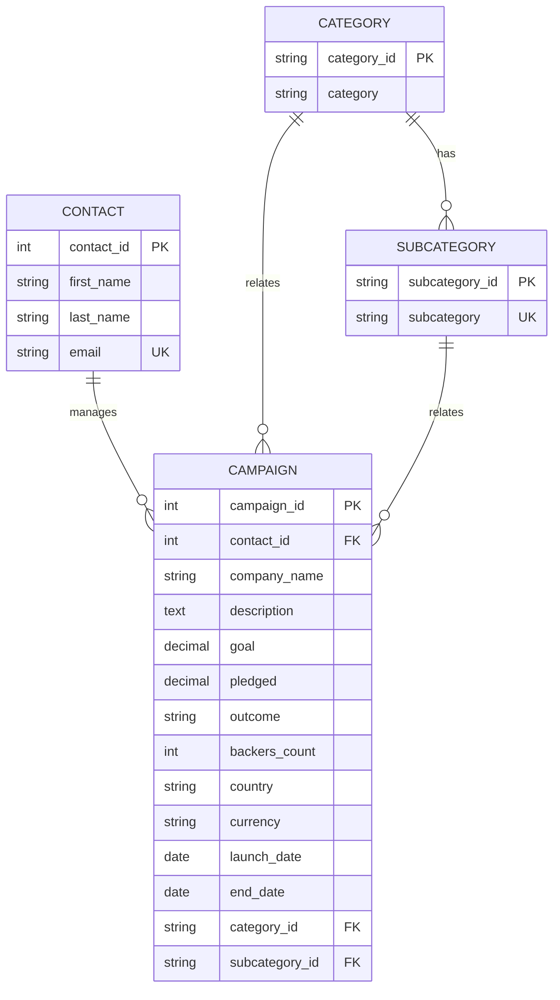

# ETLPipeline


## Overview

This project implements an ETL (Extract, Transform, Load) pipeline for crowdfunding data. The pipeline extracts data from various sources, transforms it into a suitable format, and loads it into a database for further analysis.

## Installation

To install the required dependencies, run:

```sh
pip install -r requirements.txt
```

## ER Diagram

- [PNG](images/er-diagram.png)




## Usage

To run the ETL pipeline, execute the following command:

```sh
python app.py
```

## Database Backup

To create a backup of the database, use the following commands:

```sh
pg_dump -U postgres -F p -f generated/db_backup.sql crowdfunding_db

pg_dump -U postgres -F c -f generated/db_compressed.dump crowdfunding_db

pg_dump -U postgres -F t -f generated/db_backup.tar crowdfunding_db
```

## License

This project is licensed under the GNU General Public License v3.0. See the [LICENSE](LICENSE) file for details.
